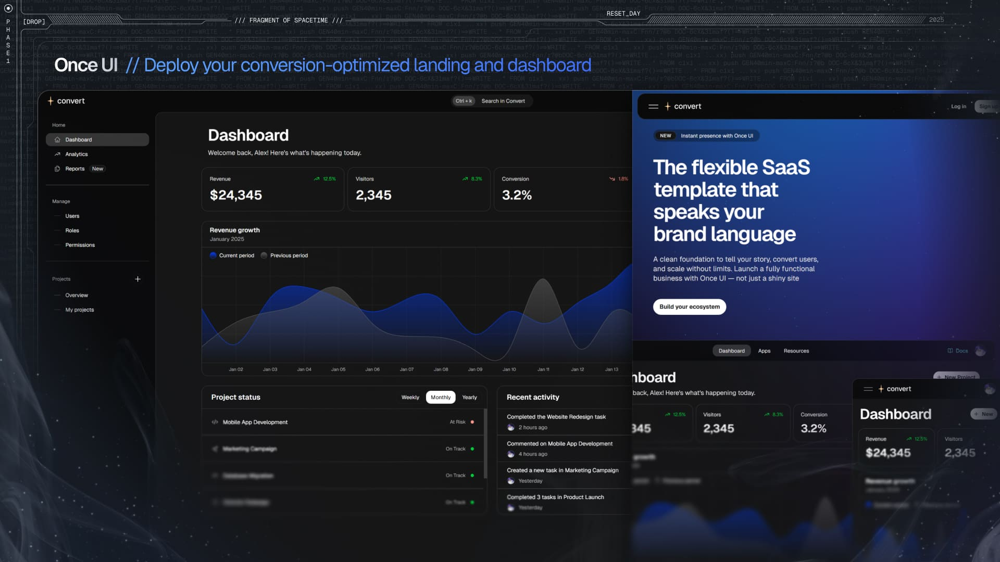

# Once UI for Next.js

A design system for indie builders, startups and freelancers. Once UI combines the simplicity of low-code with the power of code: write 70% less compared to shadcn + tailwind.

## Features

* **Landing page**: A conversion-optimized landing page setup.
* **Dashboard**: A responsive dashboard setup with data visualization.
* **Customization**: Manage design config in a single file.
* **Components**: Access Once UI components with simple APIs.
* **SEO**: Enjoy a simplified SEO setup with a single source of truth for meta details.
* **PRO**: Seamlessly integrate elements from other Once UI products and our Block library.

## Demo

Check the [demo app](https://convert.once-ui.com).

## Documentation

Read the documentation at [docs.once-ui.com](https://docs.once-ui.com/magic-convert/quick-start).

## Combine with other products

[Magic Agent](https://once-ui.com/products/magic-agent) (PRO): Our premium agent that lets you launch your chatbot in minutes.

[Magic Docs](https://once-ui.com/products/magic-docs) (PRO): Our premium documentation generator. Just add your MDX files and let Magic Docs handle the rest.

[Once UI Blocks](https://once-ui.com/blocks) (PRO): Copy-paste pre-designed blocks and deploy fully-functional sites with lightning speed.

## Creators

Connect with us!

**Lorant One**: [Site](https://lorant.one) / [Threads](https://www.threads.net/@lorant.one) / [LinkedIn](https://www.linkedin.com/in/lorant-one/)

## Become a Oncer

Join the [Design Engineers Club](https://discord.com/invite/5EyAQ4eNdS) on Discord to connect with us and share your projects.

# License

TL;DR: Access to Magic Convert under Once UI Pro allows personal/internal use and modifications, but prohibits SaaS, resale, redistribution, and public sharing.

See `LICENSE.txt` for more information.